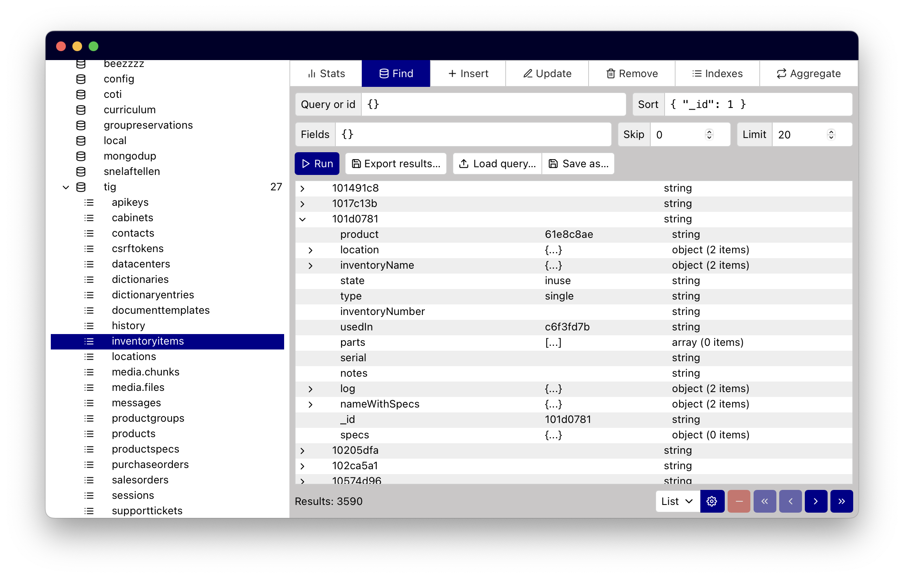

# Rolens: intuitive MongoDB administration tool

Robust, blazing-fast, comprehensive, yet simple [MongoDB](https://www.mongodb.com/) administration tool for Windows, macOS and Linux.

 

<!--  -->

## Why another MongoDB client?

This project arose from all flaws of similar tools many of which are slow, complicated, heavy, and fairly unwieldy. They mostly require a reasonably high level of knowledge on how to operate the program.

**Rolens aims to be the intuitive, lightweight counterpart of these overengineered tools.**

- [x] **Lightweight**: Rolens weighs about 15 MB.
- [x] **Open source**: You know what's inside!
- [x] **Low overhead**: Typical query results against a local database are returned whithin milliseconds.
- [x] **Intuitive interface**: You know MongoDB? You know Rolens.

This project is heavily inspired by the excellent [MongoHub](https://github.com/bububa/MongoHub-Mac) application, which sadly has not been updated since 2011.

## Download and installation

Rolens can run on the following operating systems:

* Windows 10/11 amd64/arm64
* Linux amd64/arm64
* macOS 10.13+ amd64 (Intel)
* macOS 11.0+ arm64 (Apple Silicon)

### Pre-compiled binaries

You can obtain a pre-compiled Rolens binary for macOS or installer for Windows from the [release page](https://github.com/garraflavatra/rolens/releases/latest).

### Compiling from source

If you have Node.js installed, just download the source from GitHub, and run `./build.js`. The install script will check that dependencies are present and build Rolens for you.

If you want to build it yourself, please refer to the [advanced build process documentation](https://garraflavatra.github.io/rolens/development/advanced-build/) for detailed compilation instructions.

## User guide

Rolens is designed to be as intuitive as possible. But if something is unclear nevertheless, you can consult [the user manual](https://garraflavatra.github.io/rolens/) to learn how to use the program.

## Questions and bugs

* Did you capture a **bug**? Please [report it](https://github.com/garraflavatra/rolens/issues/new?assignees=garraflavatra&labels=bug&projects=&template=bug.yml) — thank you!
* Would you like to see a new **feature**? You can [request it](https://github.com/garraflavatra/rolens/issues/new?assignees=garraflavatra&labels=enhancement&projects=&template=feature.yml).
* Do you have a **question**? Ask questions on [the discussion board](https://github.com/garraflavatra/rolens/discussions/new?category=questions).

Feel free to contact me if you have questions! [Send an e-mail.](mailto:romein@vburen.nl)

## Author and license

© [Romein van Buren](mailto:romein@vburen.nl) 2023. The source code and compiled binaries are released under the GNU GPLv3 license — see [`LICENSE`](./LICENSE) for the full license text.

## Credits

* [Wails](https://wails.io/) facilitates the build process for multiple OSes.
* The installer for Windows is generated by [NSIS](https://nsis.sourceforge.io/Main_Page).
* Icons are from [Feather Icons](https://feathericons.com/) by [Cole Bemis](https://github.com/colebemis).
* Vector drawings come from [unDraw](https://undraw.co/).
